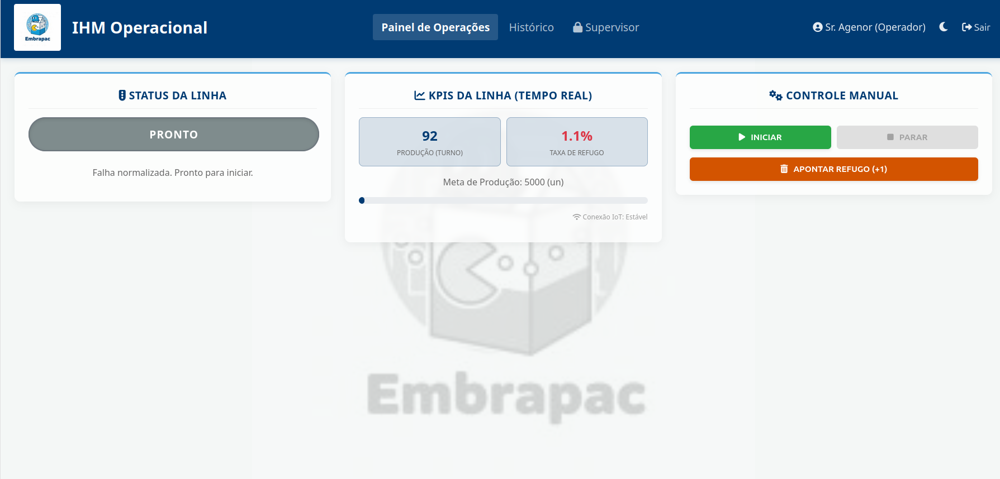
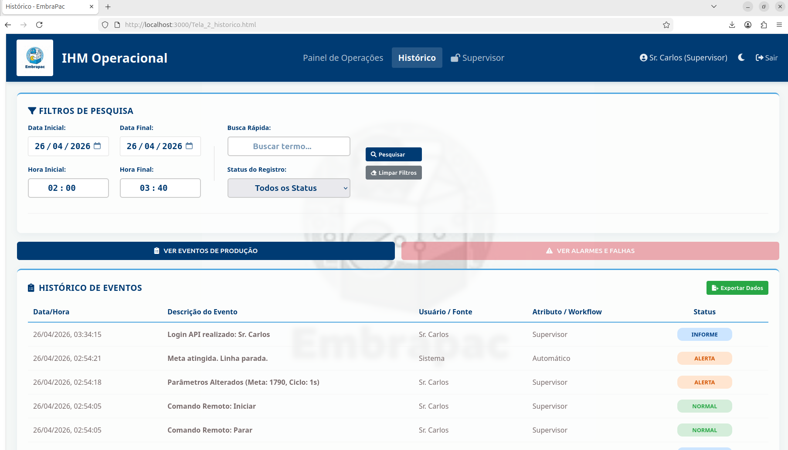
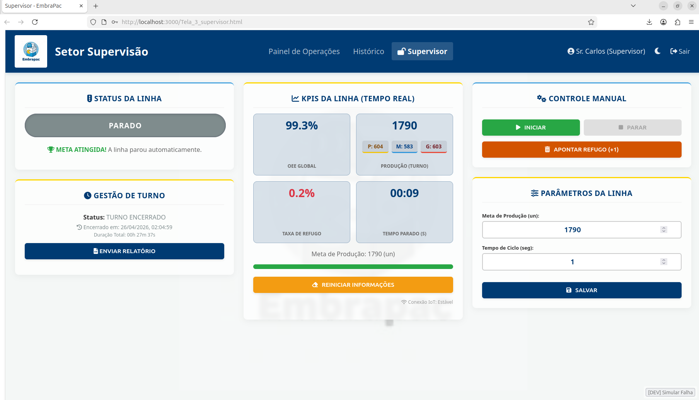

# EmbraPac - Sistema de Supervisão e Controle (IHM) & Edge Server


> Uma Interface Homem-Máquina (IHM) de alta fidelidade e um Edge Server robusto para controle de linhas de produção, integrando Inteligência Artificial (YOLO), hardware (ESP32) e sincronização em tempo real.

---

## Sobre o Projeto

O **EmbraPac IHM** é uma aplicação web e um servidor de borda (Edge Server) desenvolvido para modernizar o ecossistema de controle de uma linha de empacotamento industrial. O sistema foi projetado para aplicar conceitos reais de **Indústria 4.0**.

O sistema evoluiu de uma simulação local para uma arquitetura **OT (Operation Technology) Bidirecional**. Conta com um back-end dedicado em Node.js que orquestra a base de dados relacional, a segurança corporativa e a comunicação IoT com o chão de fábrica, garantindo a integridade dos dados e o cálculo de eficiência (OEE) em tempo real.

### Principais Funcionalidades

* **Integração IoT Bidirecional (MQTT):** Comunicação padronizada em JSON com microcontroladores (ESP32) e câmeras de Visão Computacional, suportando tolerância a falhas de rede.
* **Segurança Zero Trust (JWT):** Autenticação corporativa baseada em JSON Web Tokens. As rotas da API e os comandos via WebSockets estão blindados contra acessos não autorizados.
* **Persistência Industrial (MariaDB):** Registro auditável e seguro de todos os logs, alarmes e métricas de turnos em um banco de dados relacional de alto desempenho.
* **Sincronização em Tempo Real:** Comunicação instantânea entre a tela do Operador e do Supervisor via `Socket.io`.
* **Protocolo de Segurança de Falhas:** Sistema de tratamento de alarmes em **2 Etapas** (Reconhecimento seguido de Confirmação).

---

## Arquitetura Técnica

O projeto segue agora uma arquitetura **Edge Computing** completa:

1. **Front-end (Vanilla JS):** A interface consome os dados do servidor e reage às mudanças de estado, garantindo sincronia perfeita.
2. **Back-end (Node.js + Express):** O "cérebro" do sistema. Gerencia a lógica de negócio, a API REST e a validação de segurança.
3. **WebSockets (Socket.io):** O barramento central para as interfaces web, transmitindo a nova "fonte da verdade" instantaneamente.
4. **Broker MQTT (Mosquitto):** A ponte de comunicação com o mundo físico (sensores, motores, ESP32).
5. **Base de Dados (MariaDB):** Armazenamento permanente da estrutura de usuários, histórico de produção e logs.

---

## Protocolo de Comunicação IoT (Contrato JSON)

Para garantir a simetria de dados entre a equipe de Software e a de Hardware (Visão Computacional), o sistema utiliza os seguintes pacotes JSON via MQTT:

### 1. Pacote de Comando (IHM ➔ Máquina)

* **Tópico:** `embrapac/comando/esteira`
* **Descrição:** Ordens de controle da interface web para atuar nos relés da esteira.

```json
{
  "command": "START",
  "timestamp": 1713000000000,
  "source": "Sr. Carlos"
}
```

### 2. Pacote de Telemetria (Máquina ➔ IHM)

* **Tópico:** `embrapac/ihm/count`
* **Descrição:** Confirmação do sensor óptico/IA informando a passagem e a classificação de uma caixa.

```json
{
  "class": "Grande",
  "confidence": 0.98,
  "timestamp": 1713000005000
}
```

### 3. Pacote de Segurança (JWT)

* **Descrição:** O "Crachá Digital" gerado pelo MariaDB + Node.js. Exigido pelo middleware para qualquer comando crítico na IHM ou na API. Contém privilégios de acesso (Nível 1, 2 ou 3) e expira a cada turno (8h).

***

## Telas do Sistema

1. Painel do Operador

Focado na execução. Interface limpa com controles grandes, feedback visual de status e barra de progresso da meta.
</img>

2. Historico de Ações

Focado na segurança e rastreabilidade. Demonstração de logs recuperados diretamente do MariaDB, com pesquisa dinâmica.
</img>

3. Painel do Supervisor (Dashboard)

Focado na gestão. Apresenta KPIs detalhados, exportação CSV e alteração de parâmetros de produção.
</img>

***

## Testes Unitários

O projeto inclui uma suíte completa de testes unitários para validar e proteger as regras implementadas contra regressões.

### Como rodar os testes

```bash
# primeira vez
npm install --save-dev

# rodar suíte completa
npm test

# com detalhes
npx jest --runInBand --verbose
```
### Cobertura Atual

* 15 testes totais (100% PASS) abrangendo autenticação, lógica de máquina, estrutura HTML e filtros de histórico.

***

## Como Executar

### Pré-requisitos do Sistema

   1. Node.js (Obrigatório versão v18.0.0 ou superior)

   2. MariaDB (Rodando localmente com o banco de dados embrapac_db)

   3. Eclipse Mosquitto (Serviço MQTT rodando na porta 1883)

### Passos de Instalação

1. Clone o repositório ou baixe os arquivos.

2. Abra o terminal e navegue até a pasta do servidor:

```bash
cd backend
```

3. Instale todas as dependências do projeto automaticamente:

```bash
    npm install
```

4. Inicie o servidor Edge:
   
```bash
    npm start
```

***

### Acessar o Banco de Dados

### 🗄️ Configuração do Banco de Dados

1. Certifique-se de que o MariaDB está instalado e a rodar na sua máquina local:
   ```bash
   sudo apt update
   sudo apt install mariadb-server -y
   sudo service mariadb start
   ```
2. Crie a estrutura de tabelas e os utilizadores padrão executando o script de inicialização (init_db.sql) que se encontra na pasta backend:

* Pode abrir o seu gestor de base de dados (como DBeaver) e rodar o ficheiro backend/init_db.sql.

*   Ou, se preferir o terminal, aceda ao MariaDB (sudo mariadb -u root -p) e cole o conteúdo do ficheiro lá dentro.

3. Configure as variáveis de ambiente:

*   Na pasta backend, crie um ficheiro chamado .env e configure as suas credenciais de acesso locais:

```bash
DB_HOST=localhost
DB_USER=root
DB_PASSWORD=sua_senha_do_banco
DB_NAME=embrapac_db
MQTT_BROKER_URL=mqtt://localhost:1883
```
***

### Acessar o Sistema

Abra o seu navegador no endereço fornecido pelo servidor (ex: http://localhost:3000/Tela_1_operador.html).
O sistema validará o login no banco de dados gerando um Token JWT válido.

| Perfil | Senha | Nível de Acesso |
| :--- | :---: | ---: |
| Operador | op123 | Nível 1 (Operacional) |
| Supervisor | admin123 | Nível 2 (Gestão Completa) |

(Nota: As senhas acima são os padrões inseridos automaticamente na primeira execução do banco de dados. Recomenda-se alterá-las em produção).

## Histórico de Versões

 *   v3.0 - Industrial Edge Server (Atual): Migração para MariaDB, Implementação de MQTT bidirecional, payloads JSON e Segurança Zero Trust com JWT.

 *   v2.0 - Client-Server: Implementação do Node.js e WebSockets para sincronização de telas.

 *   v1.0 - Gold Master: Simulação local, unificação do protocolo de alarmes e cálculo de OEE.

<p align="center"> Desenvolvido pela Equipe Embarcados 1 - CPQD. </p>